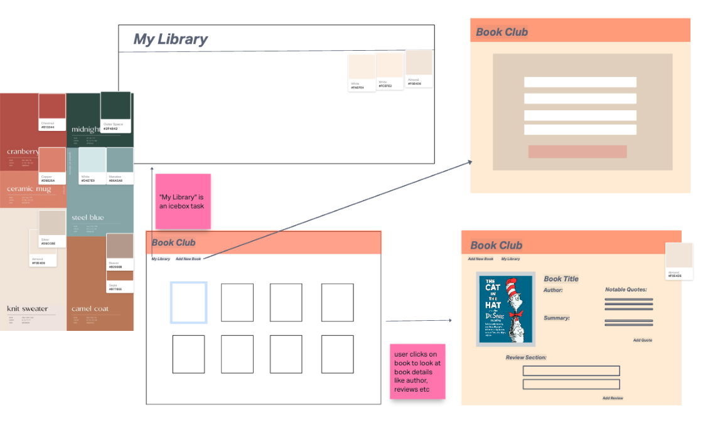
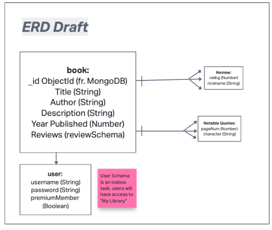
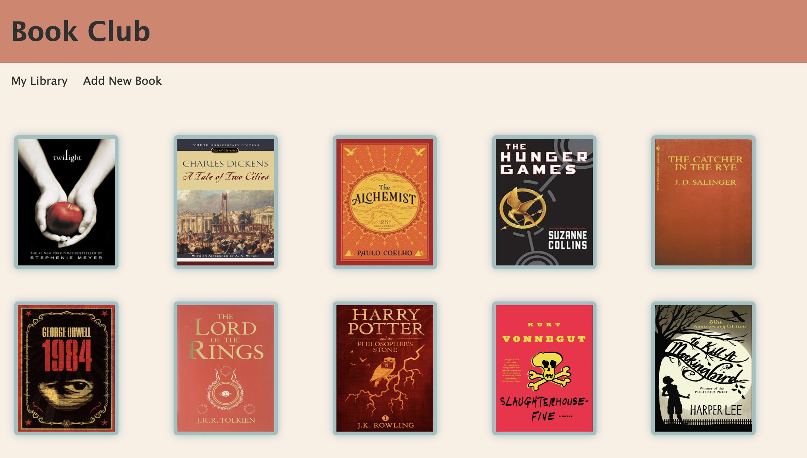
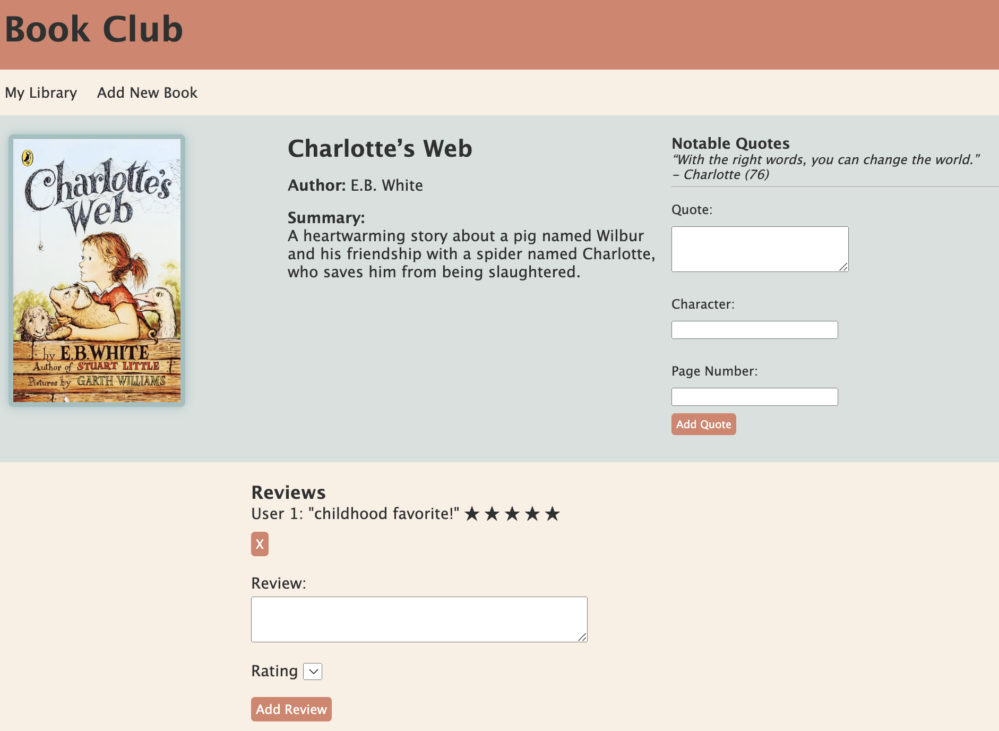
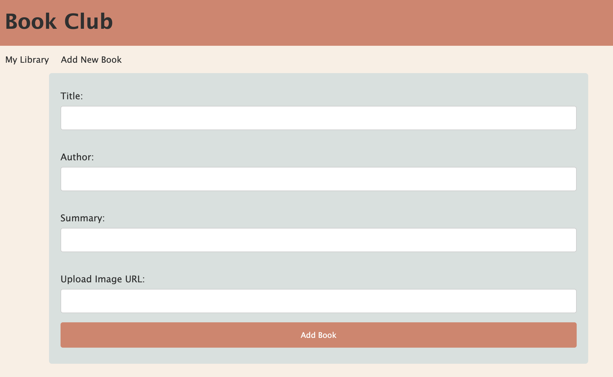

# Book Club

### Table of Contents

* [About the Project](#about-the-project)
* [Getting Started](#getting-started)
* [MVP Goals](#mvp-goals)
* [Wireframe](#wireframe)
* [Technolgies Used](#technologies-used)
* [Coding Challenges](#coding-challenges)
* [Next Steps](#next-steps)
* [Contributions])(#contributions)

---
## About the Project

Book Club is a full-stack web application which allows users to browse, and review books. Each user has the ability to read, create and delete both book reviews and notable quotes from the book of their choice. Book Club was designed so that readers can have a community where they can log and keep track of the books they read while also interacting with other user's to share or discuss differing opinion.

## Getting Started

To checkout the app, simly visit the [deployed website.](https://immense-river-09934.herokuapp.com/books)

You can also view the project's planning board on [Trello.](https://trello.com/invite/b/J2F5D3H0/ATTI65091d5a24ee8b844a650b56ad6602136DA3A27F/project-2)

## MVP Goals 

 

1.Build a fully functional full-stack web application.
2.Have full CRUD functionality.
3.Style a simple homepage displaying the current catalogue  of books.
4.Create paths for users to be able to find more information about a book by clicking the cover image of the title they want to explore.
5.Allow users to add their own review for a book.
6.Allow users to delete their own review for a book.
7.Allow users to edit their book reviews.
8.Allow users to add a new book to the catalogue.
9.Deploy successfully on Heroku

## Wireframe:

The images below show how we designed our application, we had some trouble trying to choose an optimal style for users but we decided to go with the most user friendly and simple set-up. 

A user will be able to start on the home page with the index of current books on the website. From there they can choose a book they are interested in learning about or a book that they have already read. Once they click on the book cover they are interested in they will be redirected to another page where they can see the  Title, Author, and Summary of the book. There may be some reviews and notable quotes already on the page if the book has been there for a while and they can choose to add, edit or delete the reviews and notable quotes.

### Example Site Pictures:

## Technologies Used

* Node.js
* Express
* MongoDB
* EJS
* Heroku
* HTML
* CSS

## Next Steps

*Add user authentication so user's can save their added books
*Implement search functionality with additional filters
*Integrate an external book review API for more comprehensive book data
*Allow memebers to thumbs up/down reviews and quotes

## Contributions

### Nia Salgado
* Backend Development and Front-End Development

### Pamela Stankova
* Backend Development and Front-End Development

## Acknowlegements
* Instructional Team at Adobe Digital Academy
* Stack Overflow.
* https://www.w3schools.com/
